# **Programs**

The main objective is to read data from an IMU sensor and send this data to a main computer for its real-time processing.

**Program to read data from an IMU sensor**

A first simple program is created to read IMU MPU9250 sensor. We can use the libraries:
- SparkFunMPU9250-DMP (IMU_read1.ino)
- MPU9250 by hideakitai (IMU_read2.ino)

We propose you some sample programs to review the communication performances using:
- Bluetooth 
- WiFi

## **1. Bluetooth communication**

The ESP32 offers both Classic Bluetooth (BR/EDR) and Bluetooth Low Energy (BLE).

**Classic Bluetooth** (BR/EDR):

- Higher Data Rates: Designed for continuous data streaming
- Higher Power Consumption
- Range: Generally 10-30m
- Use Cases: Audio streaming (A2DP), serial communication (SPP), and other applications requiring continuous data transfer.

**Bluetooth Low Energy** (BLE):

- Low Power Consumption
- Lower Data Rates: Not ideal for continuous high-bandwidth data streaming.
- Short Bursts of Data: Designed for unfrequent data transfers, such as sensor readings, notifications, and control signals.
- Range: Can achieve comparable or even better range than Classic Bluetooth 
- Use Cases: Wearables, IoT devices, and other applications where low power consumption is crucial.

We will use Classic Bluetooth to send data to:

- a mobile phone: You need to install one of the following Apps to be able to see the data sent by the ESP32:
    - Serial Bluetooth Terminal App
    - BluetoothElectronics App
    - Arduino Bluetooth control App
    - others...
- computer: Has to be able to read the data sent by the ESP32, or you need to use a Bluetooth dongle.

  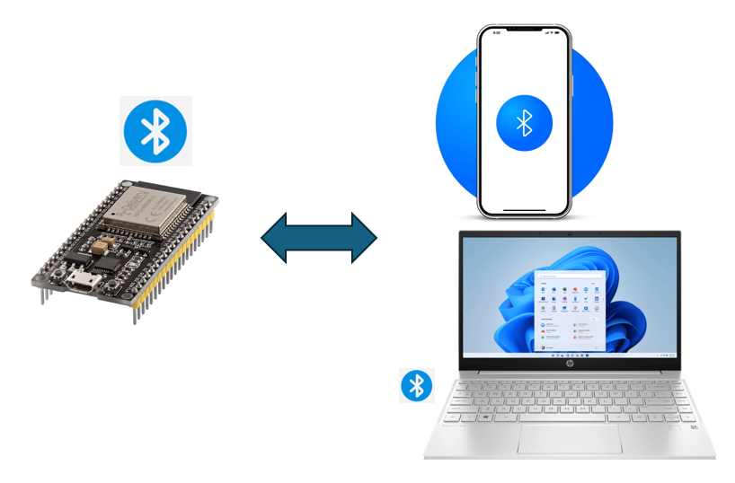

**BT_test1**:
- Read input from monitor and write to Mobile
- Read input brom Mobile and write to Serial Monitor

|  | 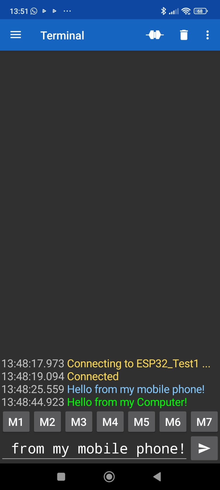 |
|:--:|:--:|
| **Serial Monitor** | **Mobile Phone BT** |

**BT_test2**:
- Send data to Mobile
- Send data to Serial Monitor

| 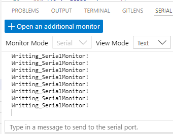 | 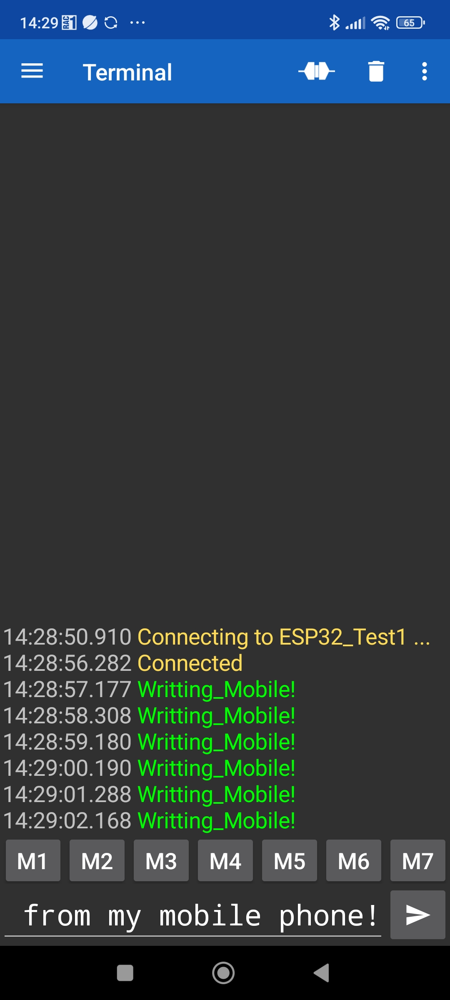 |
|:--:|:--:|
| **Serial Monitor** | **Mobile Phone BT** |

**BT_IMU_send2phone**

We have made some modifications to the initial program to send IMU data to a mobile phone.: 

| 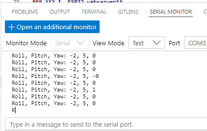 | 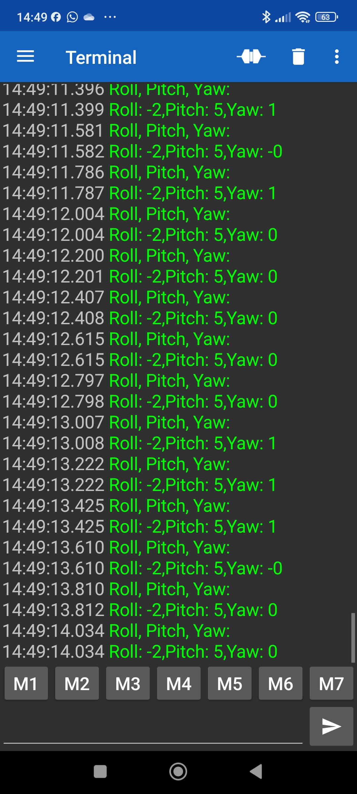 |
|:--:|:--:|
| **Serial Monitor** | **Mobile Phone BT** |

**BT_IMU_send2PC**

We have add to the previous program a python code in out PC to receive IMU data from ESP32 IMU sensor.
Before running python code, you need to:

- Install the libraries: pip install pygame pyserial matplotlib
- Type "Bluetooth" in your PC searching line to Pair your ESP32 with your computer: Through your operating system's Bluetooth settings.
- Type "Dispositius" to find the Bluetooth port: Look in your operating system's Bluetooth settings or in the "Device Manager" (Windows) to find the port name assigned to your ESP32.
- Run the Python code.

| 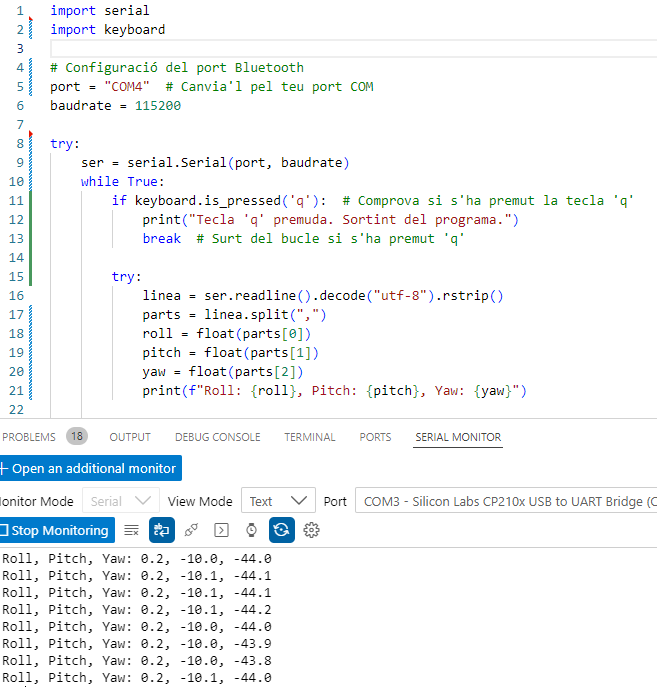 | 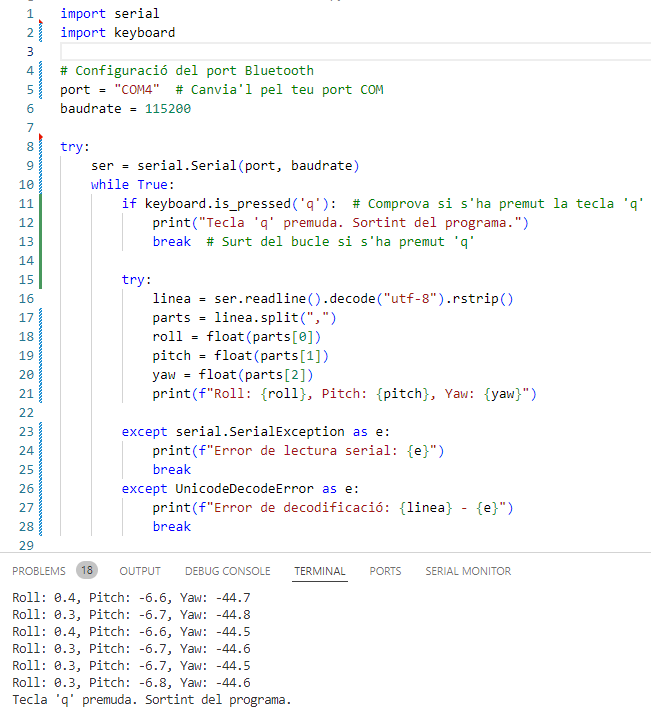 |
|:--:|:--:|
| **Serial Monitor** | **PC received BT** |

## **2. WiFi communication**

Assigning fixed IPs and hostnames to each ESP32 prevents IP conflicts and simplifies device management, making it easier to identify and access each device consistently. This is especially useful in a lab with multiple devices.

A First program has been made to assign IP address and hostname to an ESP32: **WiFi_IP_hostname.ino**

| 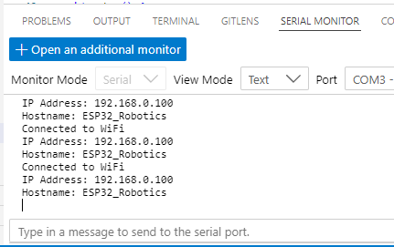 |
|:--:|
| **Serial Monitor** |

In this program we have created a configureNetwork() function that we can use in applications where we are using several ESP32s.

The main objective is to read an IMU sensor and send data to a local computer to make postprocessing.

The ESP32 offers different interesting options:
- Webserver 
- Socket UDP

### **2.1. ESP32 webserver**

Publishes IMU data in real-time to a web server located in ESP32 

Programs:
- WiFi_WebServer_IMU1.ino: Uses SparkFun IMU library
- WiFi_WebServer_IMU2.ino: Uses mpu9250.h IMU library

| 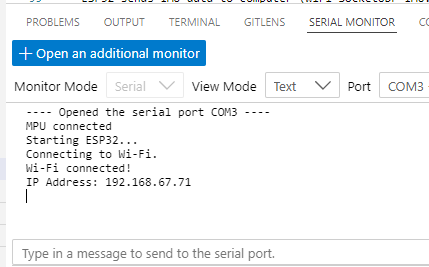 | 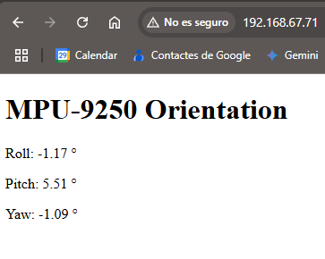 |
|:--:|:--:|
| **Serial Monitor** | **Web Server** |

### **2.2. Socket UDP**

This program reads orientation data (roll, pitch, yaw) from an MPU-9250 sensor connected to an ESP32 and sends this data over a Wi-Fi network using UDP (User Datagram Protocol) to a specified IP address and port.

This is useful for applications where you need to receive sensor data on a computer or other device in real-time. UDP is chosen for its speed and low overhead, making it suitable for streaming data, even though it doesn't guarantee delivery like TCP.

Programs: 
- **WiFi_SocketUDP_IMU**

    - ESP32 connects to the WiFi network
    - sends IMU data to computer
    - Computer listens to all interfaces (IPs)
    - Extracts the RPY values

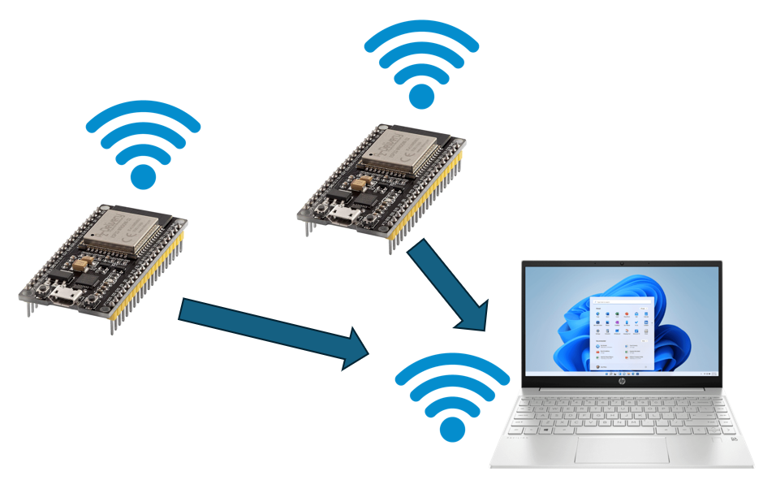

| 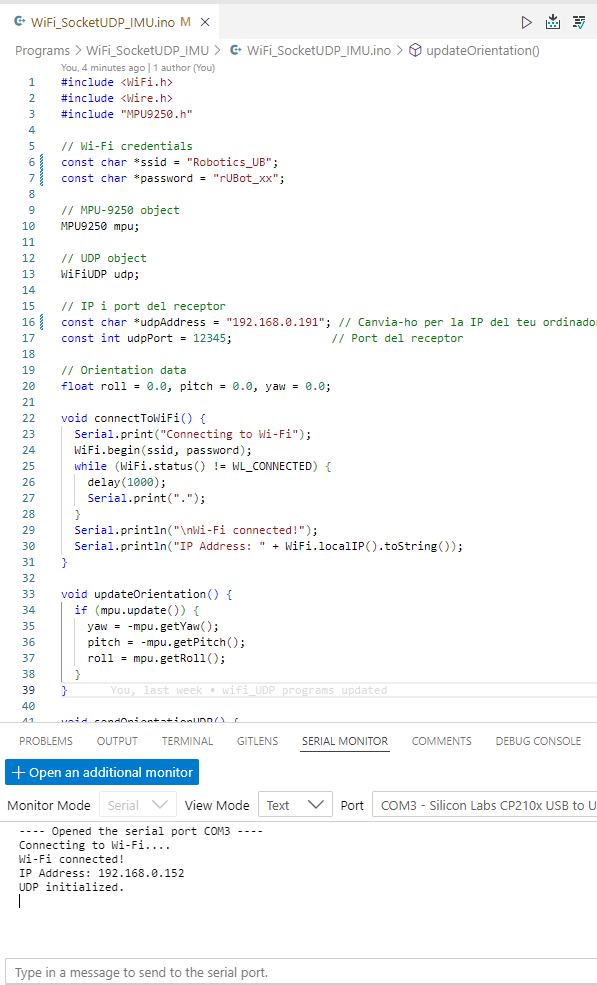 | 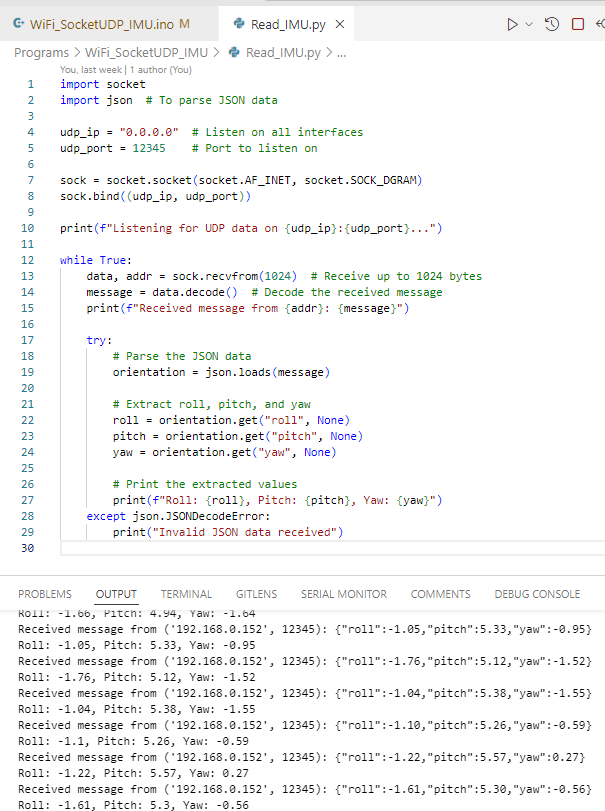 |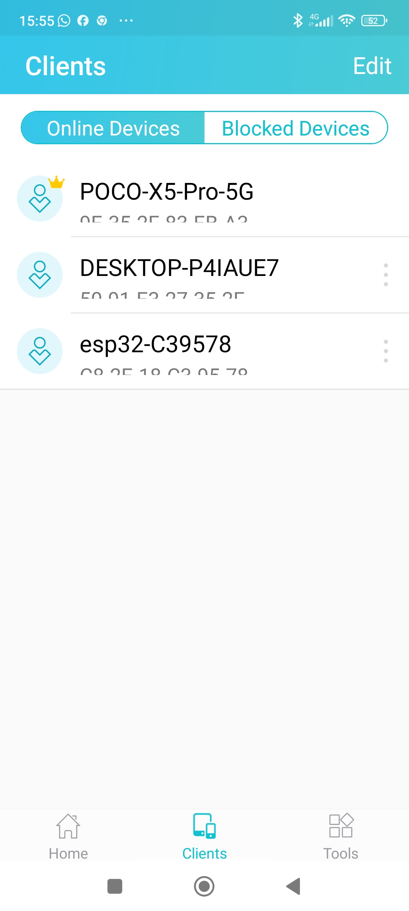 |
|:--:|:--:|:--:|
| **Serial Monitor** | **Computer** | **Router** |

- **WiFi_SocketUDP_2IMU**

    ESP32_1 and ESP32_2 sends IMU data to computer

- **WiFi_SocketUDP_2_ESP32** 

    ESP32_receiver listen RPY data from ESP32 sender and ESP32_sender sends RPY data to ESP32_receiver and computer.
    - ESP32_receiver (**ESP32_Receiver.ino**):
        - connects to the WiFi network 
        - displays its IP address on setup
        - receives from ESP32_sender the IMU data
    - ESP32_sender (**ESP32_Sender.ino**)
        - connects to the same WiFi network
        - sends IMU data to ESP32_receiver and computer
    - Computer (**Read_from_sender.py**)
        - listens to all interfaces (IPs)
        - Extracts the RPY values received from ESP32_sender

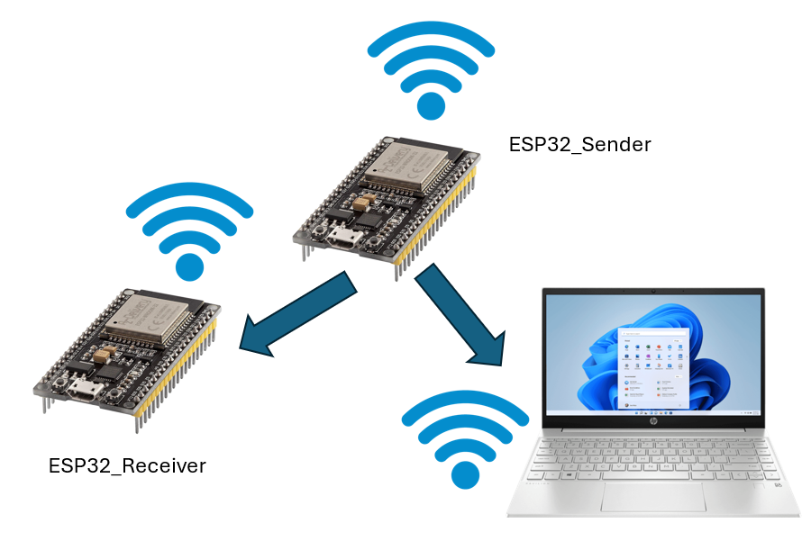

| 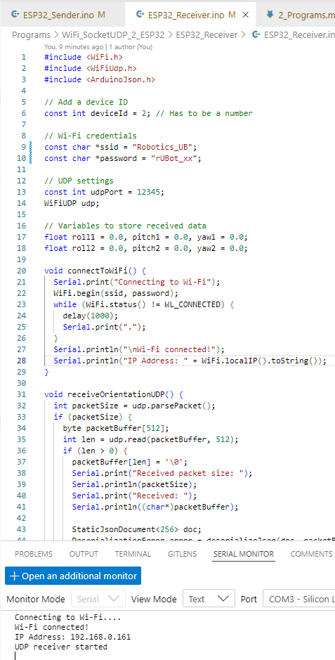 |  |
|:--:|:--:|
| **Serial Monitor Receiver (IP: 192.168.0.161)** | **Serial Monitor Sender (IP: 192.168.0.152)** |

| 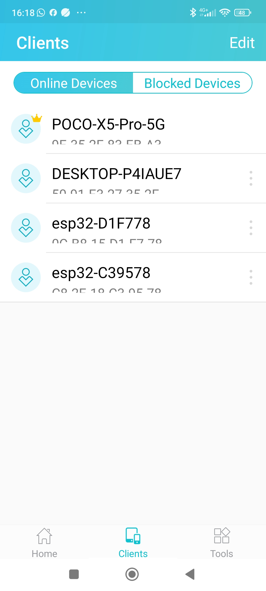 | 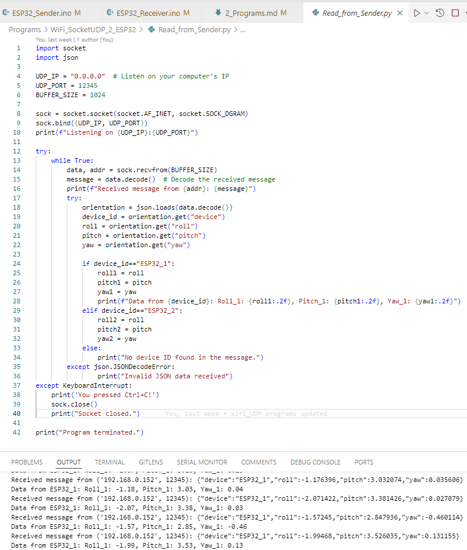 |
|:--:|:--:|
|  **Router** | **Computer received data** |